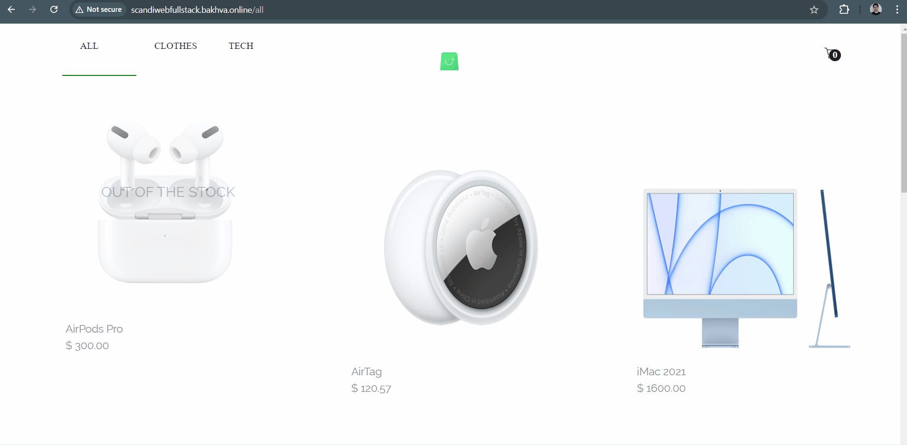

# Junior Full Stack Developer test task

## Overview

The data is fetched from the GraphQL endpoint (http://scandiwebfullstackapi.bakhva.online/graphql) and provides an interface to view and interact with this data.

The project is built following design and functionality principles from this  [link](https://scandiweb.notion.site/Junior-Full-Stack-Developer-test-task-3833494124714845b71bf46096b6eeb9).

The outcome is not pixel-perfect to the provided design, but there are no noticeable mismatches both in terms of design and functionality
## Demo


## Run Locally

Clone the project

```bash
  git clone https://github.com/Bakhva-Meladze/scandiweb-fullstack-FE
```

Go to the project directory

```bash
  cd scandiweb-fullstack-FE
```

Install dependencies

```bash
  npm install
```

Start the server

```bash
  npm start
```
